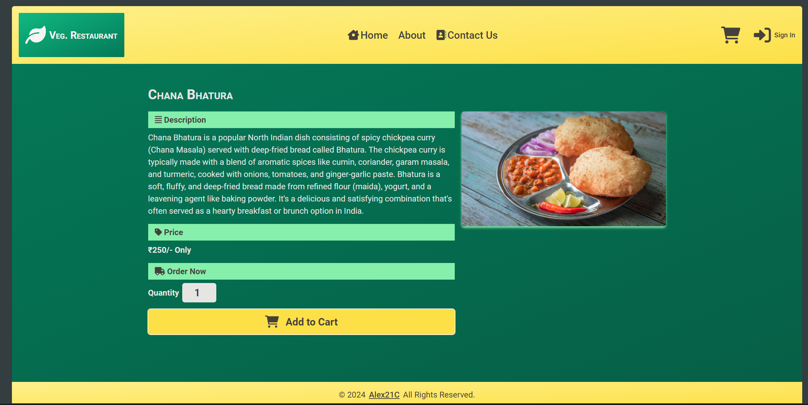

# Module#5 React MCT Project: Food Delivery WebApp


## Hosted Version of the Project:
[m5react-mct-project-food-delivery-webapp](https://m5react-mct-project-food-delivery-webapp.vercel.app/)

## Project Description
A food delivery app built using React offers a dynamic and user-friendly interface for ordering food from various restaurants. Leveraging React's component-based architecture, developers can create interactive features like real-time menu browsing, secure payment processing, and order tracking. React's efficiency ensures smooth performance across different devices, enhancing the overall user experience.


## How to install and run in yours local machine
```bash
npm install
npm run start
```


## Tech. Stack Used:
+ [React](https://react.dev/)
+ [TailwindCSS](https://tailwindcss.com/)
+ [Google Fonts](https://fonts.google.com/)
+ [Font Awesome](https://fontawesome.com/icons/)
+ [React Router Dom](https://reactrouter.com/en/main/start/tutorial) for providing routing functionality
+ [React Context API](https://react.dev/reference/react/useContext) for providing global state across application components
+ [Material UI Snack Bar](https://mui.com/material-ui/react-snackbar/) for providing notification to user when product added to cart
+ [Mateiral UI Pagination](https://mui.com/material-ui/react-pagination/) for optimizing user bandwidth & resources utilization by loading only limited no of products and rest allowing user to load using pagination
+ [Google Firebase](console.firebase.google.com) for user Authentication, orders processing and storage

## Important 
You need to create an `.env` file in the root containing Firebase API Key and API ID.
Yours .env file should look like this
```
REACT_APP_FIREBASE_API_KEY= Yours firebase api key
REACT_APP_FIREBASE_API_ID= Yours firebase api ID
```
### How to get yours API Key & API ID
Now to get that API Key, you need to signup to [Google Firebase](console.firebase.google.com) and create new project and then crate new app,
while deploying yours app to [Vercel](https://vercel.com/) you need to specify these Enviornmnet variables inside settings.

### Why i did this?
to protect my API Key from aunthorized activity! 


## Author
[Abhishek kumar](https://www.linkedin.com/in/alex21c/), ([Geekster](https://geekster.in/) MERN Stack FS-14 Batch)


